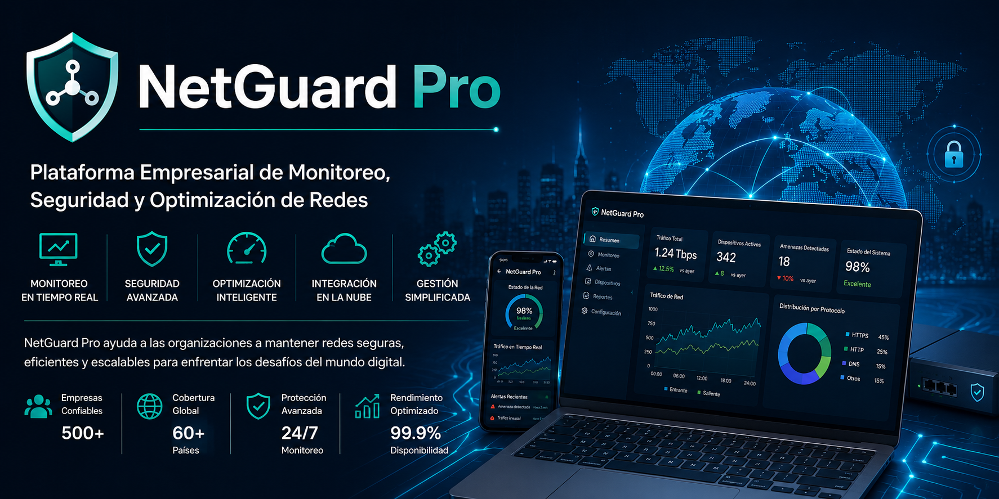
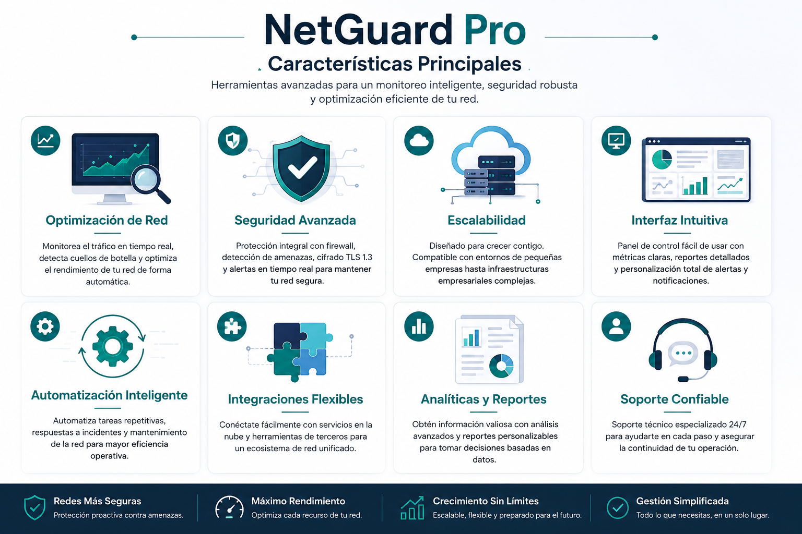
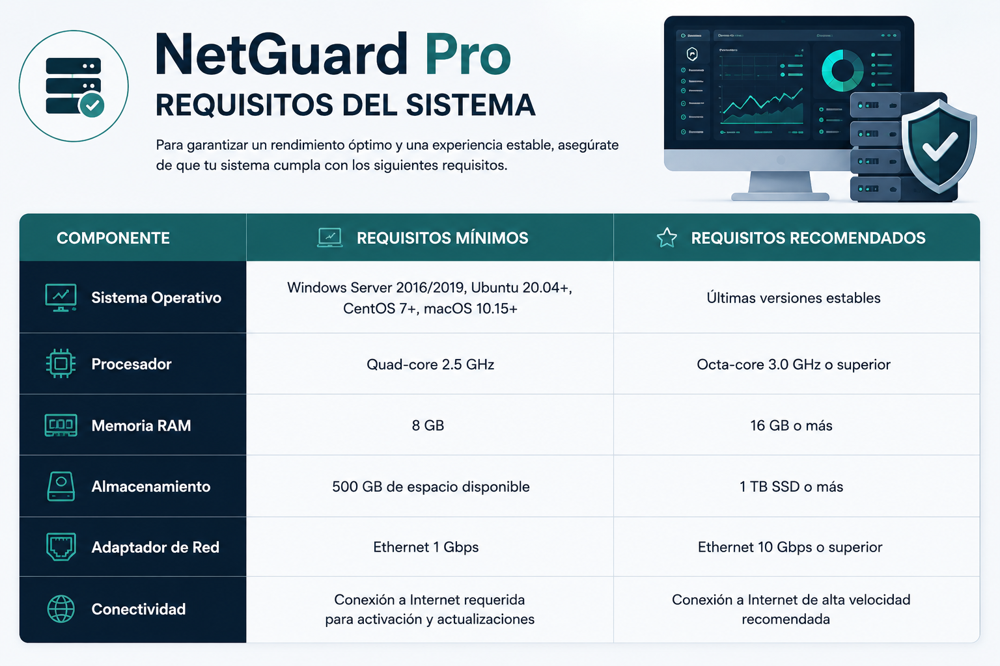
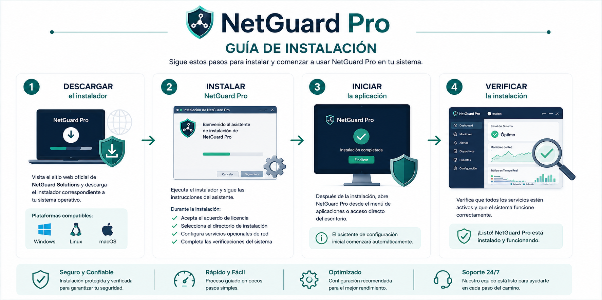
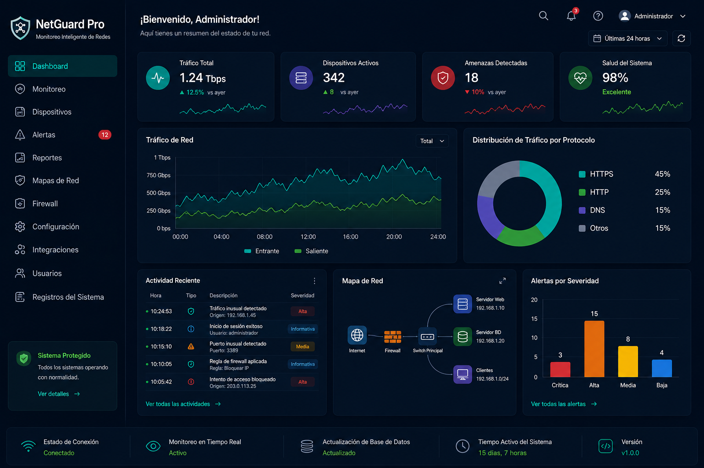

# NetGuard Pro

> Plataforma Empresarial de Monitoreo, Seguridad y Optimización de Redes

---

# Descripción General

NetGuard Pro es una solución empresarial de redes desarrollada por NetGuard Solutions para ayudar a las organizaciones a optimizar el rendimiento de sus redes, fortalecer la seguridad y simplificar la administración de infraestructura.

Diseñado para empresas de todos los tamaños, NetGuard Pro proporciona monitoreo en tiempo real, gestión inteligente del tráfico, detección automatizada de amenazas e integración fluida con servicios en la nube para garantizar operaciones de red seguras y eficientes.

Ya sea para administrar oficinas pequeñas o infraestructuras empresariales complejas, NetGuard Pro ayuda a los equipos de TI a mantener visibilidad, escalabilidad y confiabilidad operativa.

---

# Características Principales

## Optimización de Red
- Monitoreo de tráfico en tiempo real y detección de cuellos de botella
- Asignación dinámica de ancho de banda para servicios prioritarios
- Análisis automatizado del rendimiento de la red
- Balanceo inteligente de tráfico entre servidores

## Seguridad Avanzada
- Gestión integrada de firewall con reglas personalizables
- Detección de amenazas y alertas en tiempo real
- Comunicación segura cifrada mediante TLS 1.3
- Panel centralizado de monitoreo de seguridad

## Escalabilidad
- Compatible con pequeñas empresas e infraestructuras empresariales
- Integración fluida con infraestructuras cloud
- Balanceo automático de carga
- Arquitectura flexible de despliegue

## Interfaz Fácil de Usar
- Panel intuitivo para monitoreo y administración
- Alertas y notificaciones configurables
- Analítica y reportes en tiempo real
- Integración mediante API para automatización

---

# Requisitos del Sistema

| Componente | Requisitos Mínimos | Requisitos Recomendados |
|---|---|---|
| Sistema Operativo | Windows Server 2016/2019, Ubuntu 20.04+, CentOS 7+, macOS 10.15+ | Últimas versiones estables |
| Procesador | Quad-core 2.5 GHz | Octa-core 3.0 GHz |
| Memoria RAM | 8 GB | 16 GB |
| Almacenamiento | 500 GB disponibles | SSD de 1 TB |
| Adaptador de Red | Ethernet 1 Gbps | Ethernet 10 Gbps |

---

# Guía de Instalación

## Paso 1 — Descargar el Instalador

Visita el sitio web oficial de NetGuard Solutions y descarga el paquete correspondiente a tu sistema operativo.

### Plataformas Compatibles
- Windows
- Linux
- macOS

---

## Paso 2 — Instalar NetGuard Pro

Ejecuta el instalador y sigue las instrucciones del asistente.

### Durante la instalación:
- Acepta el acuerdo de licencia
- Selecciona el directorio de instalación
- Configura servicios opcionales de red
- Completa las verificaciones del sistema

---

## Paso 3 — Iniciar la Aplicación

Después de la instalación, abre NetGuard Pro desde el menú de aplicaciones o acceso directo del escritorio.

El asistente de configuración inicial comenzará automáticamente.

---

# Configuración Inicial

El asistente inicial permite a los administradores:

- Configurar ajustes de red
- Importar archivos de configuración existentes
- Definir credenciales de administrador
- Activar servicios de monitoreo
- Configurar preferencias de alertas

### Formatos Compatibles
- `.json`
- `.yaml`

---

# Activación de Licencia

Para activar NetGuard Pro:

1. Abrir el Panel de Activación
2. Ingresar la clave de licencia
3. Seleccionar el tamaño del despliegue
4. Completar la activación

También está disponible una prueba gratuita de 30 días.

---

# Vista General del Panel

El panel principal proporciona visibilidad centralizada sobre la actividad de red y el estado del sistema.

### Los administradores pueden:
- Monitorear tráfico en tiempo real
- Revisar alertas de seguridad
- Analizar métricas de rendimiento
- Configurar notificaciones
- Personalizar widgets del panel

---

# Integraciones Cloud y de Terceros

## Proveedores Cloud
- Amazon Web Services (AWS)
- Microsoft Azure
- Google Cloud Platform

## Herramientas de Terceros
- Slack
- PagerDuty
- Splunk

Estas integraciones permiten automatizar monitoreo, respuesta a incidentes y flujos de trabajo.

---

# Caso de Uso Real

Una empresa mediana de servicios financieros con múltiples sucursales utiliza NetGuard Pro para monitorear tráfico de red, detectar actividad sospechosa y optimizar el ancho de banda entre oficinas.

Gracias al monitoreo automatizado y las alertas centralizadas, la organización mejoró el rendimiento de la red, redujo tiempos de inactividad y fortaleció sus operaciones de ciberseguridad.

---

# Guía de Contribución

Aceptamos contribuciones de desarrolladores y profesionales de TI.

### Antes de contribuir:
- Sigue los estándares de codificación y documentación
- Envía pull requests detallados
- Reporta errores mediante el issue tracker
- Prueba los cambios antes del envío

---

# Solución de Problemas

## Problemas Comunes

### Fallos de Instalación
- Verifica los requisitos del sistema
- Asegura permisos de administrador
- Comprueba espacio disponible

### Problemas de Detección de Red
- Verifica permisos del firewall
- Confirma configuración del adaptador
- Reinicia servicios de monitoreo

### Errores de Activación
- Verifica conexión a internet
- Confirma validez de licencia
- Contacta soporte si el problema continúa

---

# Licenciamiento y Precios

| Plan | Precio |
|---|---|
| Equipos Pequeños | $499/mes (hasta 5 servidores) |
| Organizaciones Medianas | $1,299/mes (hasta 15 servidores) |
| Enterprise | Precio personalizado para más de 16 servidores |

Opciones disponibles en facturación mensual y anual.

---

# Soporte y Contacto

## NetGuard Solutions

- Sitio web: www.netguardsolutions.com
- Correo: info@netguardsolutions.com
- Teléfono: +1-800-555-1234
- LinkedIn: NetGuard Solutions

---

# Acerca de NetGuard Solutions

NetGuard Solutions es un proveedor líder de soluciones avanzadas de redes y ciberseguridad enfocado en optimización de rendimiento, fortalecimiento de seguridad y gestión escalable de infraestructura empresarial.

---

© 2024 NetGuard Solutions. Todos los derechos reservados.